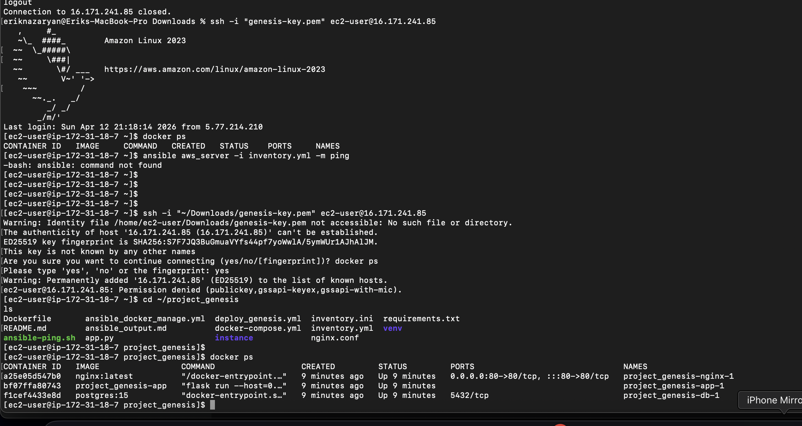
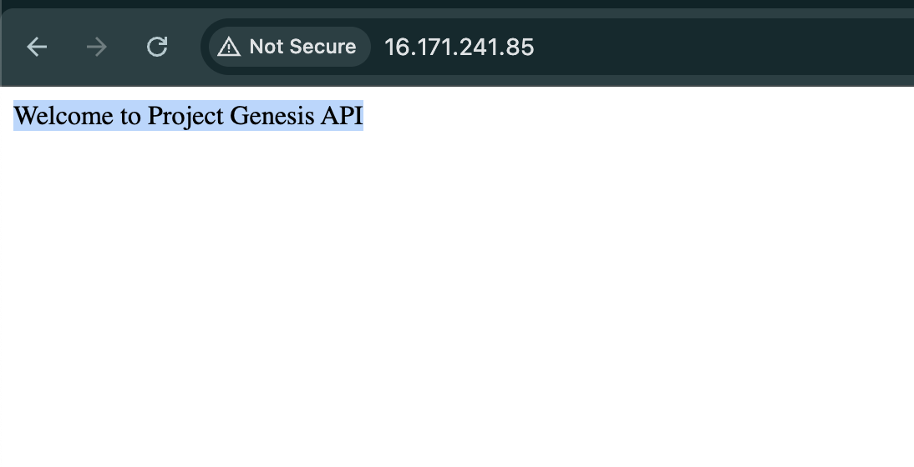

# Project Genesis Deployment Proof - AWS

## 1. Docker Containers Status

## 2. Backend API Access

## 3. Deployment Notes
- Infrastructure: AWS EC2 (t3.micro)
- Automation: Ansible
- Containerization: Docker & Docker Compose